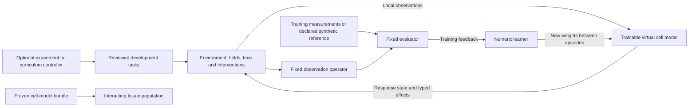

# Training virtual cell models through RL environments

Design and source evaluation, 25 September 2026, America/Los_Angeles.

## Decision and intended learner

The primary learner is a **numeric virtual-cell response model**: it observes
its local environment and retained state, then proposes its next response and
physical effects. An optional agentic controller chooses experiments or manages
training. The cell model need not be a language model, call tools or generate
text. Many simulated cells can share model weights while retaining distinct
contexts, histories and stochastic states.

This is a promising research direction with direct prior art. Build a small
training environment around the conservative reference kernel and compare RL
against direct fitting. Select a training backend only after defining the numeric
policy interface and observing a useful learning problem. No RL trainer or
continuous cell policy is implemented by this proposal.

## 1. Evidence closest to this idea

| Primary source | Inspected scope | Relevance and boundary |
|---|---|---|
| [CellTRIP preprint](https://www.biorxiv.org/content/10.1101/2025.11.21.689815v1) and [author repository](https://github.com/daifengwanglab/CellTRIP) | Indexed primary abstract; repository description and training interface | Direct precedent for interacting virtual cells learned with multi-agent RL. A candidate comparator for inferred cellular environments. Its reported applications do not establish our conservative transport, tumor response or transfer to new biological contexts. |
| [CellFluxRL preprint](https://arxiv.org/html/2603.21743v1) | Problem formulation, data, rewards and RL method | RL post-training of a cell-image generator using morphology/function-related evaluators. It handles unpaired image populations; image-generation progress is not evidence of time-resolved material transport. Useful precedent for nondifferentiable scoring and the need to preserve distributional fidelity. |
| [Wang et al., Nature Machine Intelligence 2022](https://www.nature.com/articles/s42256-021-00431-x) | Publisher/PMC indexed Results and methods | Hierarchical RL modeled a migrating cell within a measured developmental environment; subsequent biological work examined the inferred organization. Supports scoped scientific use of cell-level RL, not universal cell objectives or tumor modeling. |

These precedents mean that the broad idea of RL for virtual cells is established.
Our proposed research question is narrower: **can a compact learned response state
retain predictive accuracy under new exposure histories when its effects are
executed in a conservative, interacting physical environment?** A useful result
must improve an independently measured observable or reduce total cost at matched
error relative to strong controls. Source details appear in
[the evaluation registry](../evidence/research_implementation_sources.json).

## 2. What MiMo contributes

The user supplied [XiaomiMiMo/verl](https://github.com/XiaomiMiMo/verl) and
[MiMo-V2.6-RL-oss](https://huggingface.co/datasets/XiaomiMiMo/MiMo-V2.6-RL-oss).
The inspected source branch is `mimo-oss`, commit
`e2b9fc03c6e01247f5d93c44201b068ea320b7de`. The dataset revision inspected is
`639865fd3374018d6cb29b9fb82dd531406fcf5f`.
These identify read-only inspections, **not tested dependency pins**.

The fork adds harness integration, environment ownership, terminal grading and
failure/credit handling. Its general agent bridge returns token IDs, token masks
and token log-probabilities. Those interfaces optimize language-model generation;
they do not directly train continuous cell-state/action distributions.
[Exact agent bridge](https://github.com/XiaomiMiMo/verl/blob/e2b9fc03c6e01247f5d93c44201b068ea320b7de/recipes/general/agent_loop.py),
[environment actor](https://github.com/XiaomiMiMo/verl/blob/e2b9fc03c6e01247f5d93c44201b068ea320b7de/recipes/general/env_actor.py).

The dataset card describes software engineering, vulnerability reproduction,
knowledge work, web development and symbolic music tasks, with several grading
styles. It provides examples of training-task packaging, not cellular observations
or cell-dynamics rewards. Its declared Apache-2.0 metadata does not establish
separate rights for every referenced external asset. No model weights or biological
training data are inferred from the existence of this task dataset.

The current Dataset Viewer lists 7,780 rows across the five task families and
only training splits. Its approximately 20.9 MB of Parquet data excludes task
assets and container images. Those live Viewer counts are not revision-addressed.
An inspected research-administration example concerns budget/evidence work;
healthcare labels are not evidence of cell-simulation tasks. We would define our
own family/experimental-unit splits and independent scientific evaluator.
[Viewer size metadata](https://datasets-server.huggingface.co/size?dataset=XiaomiMiMo%2FMiMo-V2.6-RL-oss),
[split metadata](https://datasets-server.huggingface.co/splits?dataset=XiaomiMiMo%2FMiMo-V2.6-RL-oss).

| Reuse decision | Application here |
|---|---|
| Adopt conceptually now | Versioned tasks, environment/evaluator ownership, episode traces, grader identity, component rewards, cleanup and explicit failure categories |
| Adapt later if useful | A MiMo/verl tool bridge for an optional LLM experiment controller |
| Evaluate separately | A numeric RL backend with suitable observation/action distributions and recurrent-state handling |
| Do not assume | Token PPO/GRPO loss can directly optimize our numerical cell policy, or the released tasks teach cell biology |

The code example configures 8 nodes with 8 GPUs each and the general recipe
configures 4 with 8. These are author example settings, not minimum requirements
or locally reproduced performance.
[Launcher settings](https://github.com/XiaomiMiMo/verl/blob/e2b9fc03c6e01247f5d93c44201b068ea320b7de/scripts/code/env.example),
[general settings](https://github.com/XiaomiMiMo/verl/blob/e2b9fc03c6e01247f5d93c44201b068ea320b7de/recipes/general/config/general.yaml).
The local environment contract can be small and CPU-based independently of that
distributed stack. Encoding cell numbers as text would introduce a distinct
modeling choice and its own precision/parser requirements, not resolve the
numeric policy interface automatically.

## 3. Three independently versioned roles



1. **Cell model:** owns learned parameters and explicit per-cell response state.
   It predicts a supported response distribution or transition.
2. **Environment/evaluator:** owns physical equations, units, intervention timing,
   admissibility, observation meaning and scoring. It supplies no hidden answers
   to the cell policy.
3. **Optional controller:** chooses supported development experiments or curricula.
   It cannot change reference answers, conservation rules, final cohorts or reward
   definitions to make learning appear successful.

For a partially observed model, recurrent state summarizes available history.
It is not proof that all relevant biology has been observed. Training-time use of
a richer critic is a separate algorithm choice; deployed cell behavior must use
only the declared local inputs.

## 4. Minimal numeric environment contract

Proposed API shape, not an implemented or Gymnasium-conformant adapter:

```python
reset(task_spec, seed, model_bundle) -> observation, episode_info
step(cell_proposals) -> observation, reward_components, terminated, truncated, info
checkpoint() -> complete_continuation_state
restore(checkpoint) -> observation
close() -> cleanup_receipt
```

| Part | Proposed contract |
|---|---|
| Observation | Local concentrations derived from authoritative amounts/volumes, declared cell context, current time/interval, available measurements with masks, accepted model history. Predicted quantities are labeled as predictions. |
| Hidden state | Reference parameters, future measured outcomes, oracle state, evaluator internals and final benchmark identity stay outside policy inputs. |
| Action | Typed per-cell response-state replacement and a supported rate or integrated transfer proposal, with model/entity/species/interval identity. No unrestricted replacement of authoritative amounts. |
| Transition | Environment owns the timestep, assembles paired transfers, validates collective reservoir demand and publishes memory plus physical effects atomically. |
| Observation operator | Fixed mapping from the simulated trajectory/population to the actual assay and sampling times. |
| Feedback | Separate assay-fidelity components, numerical-status diagnostics and measured costs; any scalarization is versioned and frozen. |
| Termination | Declared horizon, numerical invalidity or resource exhaustion; preserve causes and incomplete trajectories. Infrastructure failures and model failures remain distinct. |
| Replay | Model/context hashes, complete physical/response state, stage clocks, events, RNG and integrator state sufficient for the chosen method. |

First action space: fixed topology and one supported same-species transfer. More
complex metabolism, secretion, growth, migration or fate changes require their
own equations, units and state contracts. A transfer into an intracellular pool
is not consumption. A future reaction must explicitly account for transformed or
untracked material.

The policy cannot change the horizon, obtain future measured exposure, request
unbudgeted retries, or omit a failed episode from evaluation. An invalid proposal
is rejected atomically. Do not silently clip a proposal or renormalize competing
cells' demands; any allocation rule is an explicit model change. Stochastic
policy state and RNG must also replay after rejection. The current stepper does
not provide that guarantee for arbitrary external mutable learners.

Keep response-state clocks consistent with the scheduler's process stages; see
section 5 of [the implementation evaluation](RESEARCH_IMPLEMENTATION_EVALUATION.md).
Split intervals at intervention discontinuities and do not interpolate unknown
exposure or assay observations as if measured.

## 5. Learning objective: predictive fidelity

For biological prediction, score agreement with measured responses under declared
interventions. A cell maximizing survival, growth or killing is an optimized
behavioral design model; it is not thereby a faithful model of the measured cell.
Keep those objectives separately named if both become useful.

A conceptual training return is the negative of a prespecified assay discrepancy
over a rollout, with declared observation times and independent-unit weighting.
No numeric reward weights, biological noise levels or acceptance margins are
chosen here. Known physical invariants are enforced by the transition, not traded
against better assay rewards. Invalid episodes remain failures even if another
reward component is high.

For distributions, a point-error reward on each generated sample can collapse
biological variability. Use an appropriate likelihood or distributional score,
and examine variance, tails and subgroup behavior on independent measurements.
Unpaired assays require population-level comparisons; they cannot supervise a
fabricated individual-cell trajectory. A sparse terminal assay may leave multiple
internal dynamics observationally indistinguishable.

Two distinct data boundaries are mandatory:

- Hidden targets that generate **training-episode rewards are training data**.
  Hiding their raw values does not turn them into a validation set.
- Final biological/numerical benchmark outcomes never supply rewards, curriculum
  choices, early stopping, model selection or calibration. Freeze the full
  candidate before scoring them. Later refitting starts a new campaign.

Weights are fixed while collecting an episode; response memory evolves according
to the model. Update weights between training episodes or rollout batches. Final
evaluation freezes weights and every fitted component. Within-subject adaptation
requires the explicit support/query protocol, not arbitrary online fitting.

### When to use RL

RL is a candidate when sequential local proposals change later environment/state,
or when useful trajectory/assay scoring is nondifferentiable. Delayed scoring
alone is not evidence that RL beats direct optimization. Compare the same allowed
inputs, state capacity, observation map and budget under:

1. Fitted small mechanistic/memory models and parameter search.
2. Supervised endpoint and multi-step sequence/distribution fitting.
3. RL or reward-based post-training of the same response model where feasible.

Policy-gradient methods need a defined stochastic action distribution and correct
log-probabilities for bounded/transformed actions. An LLM token log-probability is
not that distribution. GRPO-style group normalization can yield no useful signal
when all rollouts tie; invalid or zero-variance groups need an explicit policy.
Any learned reward model needs its own labels, split and frozen identity. Improved
reward-model score must also be examined with independent observations/metrics.

## 6. Self-learning and self-play without circular evidence

The cell model can learn through repeated supported simulated experiments. A
curriculum can vary histories, boundaries and interactions to expose failure
regions. Fixed synthetic reference laws provide exact engineering targets where
available. Successful training then establishes learning of those laws.

For biology, measurements anchor response laws and evaluation. Two learned cells
interacting can generate new trajectories, but those trajectories are predictions
from the current models, not new independent biological observations. Keep
synthetic pretraining, biological fitting and evaluation identities separate.

If the task proposer also learns, alternate frozen blocks and preserve an
unchanging development probe plus a separately sealed final benchmark. Reward
the proposer for useful learning progress under a cost budget, not merely high
loss or numerical failure. Compare random and coverage curricula. Contrastive
distillation can be a later learner objective, but prompt-induced preferences
alone cannot identify correct cell dynamics.

## 7. Ensembles for tissue and tumor-response research

The user's proposed ensemble has two useful, different meanings:

| Ensemble | Representation | Evaluation needed |
|---|---|---|
| Heterogeneous cell population | Many coexisting cell instances, potentially different type/context adapters, shared physical fields and explicit contacts | Mixed-population/co-culture observations, composition and spatial response, interaction ablations |
| Alternative fitted models | Separate complete worlds under different plausible response laws/parameter fits | Ensemble calibration and error under held-out contexts; spread is not automatically predictive uncertainty |

Do not turn alternative uncertainty models into extra physical cells. For each
world, choose a coherent model bundle; draw within-population variation from an
explicit distribution. Resampling a different uncertainty model at every step
would alter the temporal model. Separate sampling variability, context variation
and model uncertainty in the experiment design and report.

Start with shared weights and private cell state, then add a second context or
cell type only with a justified interaction. Joint material demands must be
computed from the same snapshot and resolved by the declared conservative law.
Contact effects and shared fields need separate ownership and observation maps.
Whole-population assay rewards create ambiguous cell-level credit; a centralized
training critic is a possible later comparison, while execution remains locally
conditioned. Counterfactual credit computed inside the simulator is model-based.

For tumor-response and targeted-cell-therapy research, the progression is:

1. Predict one cell-context response under a held-out intervention/history.
2. Predict a measured interaction or mixed population with frozen component models.
3. Evaluate the assembled tissue response under reserved conditions.
4. Only then compare a separate intervention-design controller on the frozen
   model ensemble, followed by independent experimental assessment.

Component accuracy does not establish the interactions. A therapy controller must
not update the response model during its evaluation until it predicts the desired
outcome. Antigen recognition, effector state, contact and tissue delivery require
their own data and interfaces. No treatment protocol, clinical performance or
personalized response is established by this design.

## 8. First implementable slice and acceptance gates

The [nonrunnable episode template](../configs/cell_model_rl.template.json) makes
the planned contracts reviewable. It supplies no biological parameters.

| Work item | Deliverable | Proceed when |
|---|---|---|
| V01 | Standard-library numeric episode harness; one synthetic cell/field species; explicit memory, typed transfer and fixed assay scorer | Matched-current-input/different-history cases, replay, atomic rejection, clocks and no oracle leakage are demonstrated |
| V02 | Small fitted/sequence controls and one suitable numeric RL comparison | Same information/capacity where feasible; held-out histories and long-horizon errors; complete costs and failure records |
| V03 | One measured assay adapter and scoped response comparison | Data/terms/units/experimental units accepted; observation mapping and independent cohorts defined; no fake pairing |
| V04 | Two-context interacting population plus separate uncertainty worlds | Coupled numerical gates R01/R02/N03, joint demand/restart evidence, supported interaction measurements |
| V05 | Optional experiment controller or external training integration | Concrete workload need, tested backend build, numeric or token interface matched to the correct learner, measured deployment costs |

The existing 96-row memoryless uptake fixture is an infrastructure control, not
a sufficient task for V01/V02. Murphy's endpoint measurements are a practical
ingestion candidate but do not establish individual-cell trajectories. None of
the inspected datasets is already accepted for this RL study. See the
[data feasibility evaluation](RESEARCH_IMPLEMENTATION_EVALUATION.md#3-data-feasibility-and-first-study).

This phase changes documentation and planning artifacts only. No MiMo, CellTRIP
or CellFluxRL code was installed/executed; no policy was trained. The repository
baseline checks and exact runtime identity are recorded in the implementation
evaluation. New environment/regression requirements are proposed, not passing
results. Large-engine execution is unnecessary for the first synthetic contract;
actual training speed and local capacity remain to be measured.
