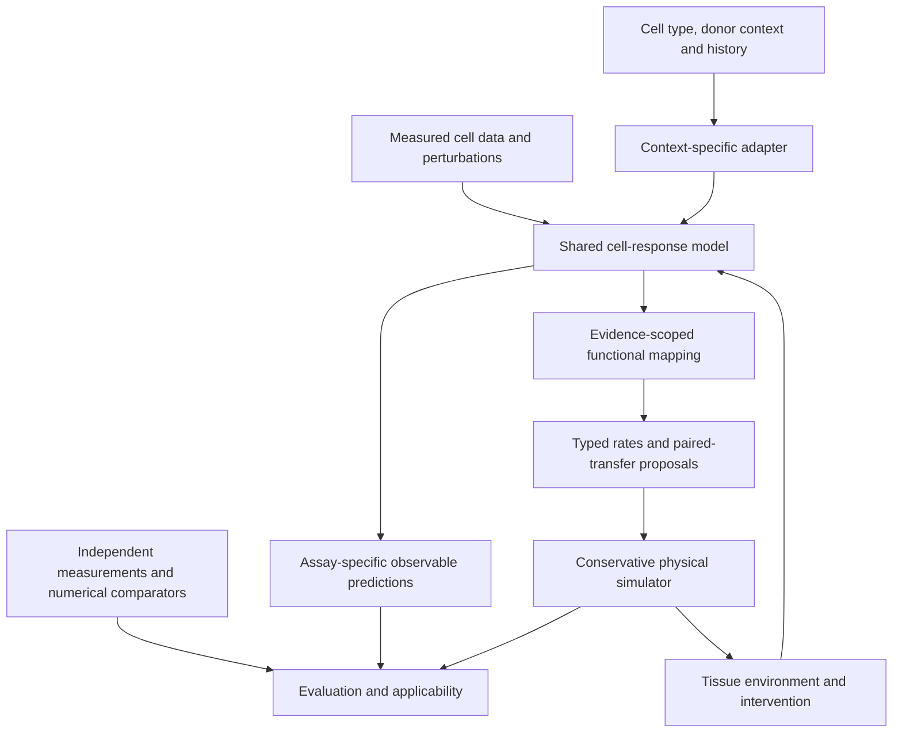

# Learning cell responses, specialization, and downstream research

Research synthesis, 25 September 2026. The user proposes a reusable virtual-cell
foundation that can specialize for different biological functions and eventually
individual contexts, inspired by biological cell reprogramming. This document
defines a research direction. A [synthetic baseline](BASELINE_PROTOTYPE.md) and
[local rules interpreter](BIOLOGICAL_RULES.md) now provide an initial executable
slice. Shared foundation models, patient adapters, cell reprogramming models,
immune models and clinical predictors remain future work.

The user's clarified direction makes the virtual cell dynamics model the primary
RL learner; an agentic experiment controller is optional. The subsequent
[RL environment design](CELL_MODEL_RL_ENVIRONMENTS.md) covers numeric policies,
delayed assay rewards, MiMo's token-training boundary and interacting ensembles.
[RESEARCH_IMPLEMENTATION_EVALUATION.md](RESEARCH_IMPLEMENTATION_EVALUATION.md)
adds source/data audits and a staged module plan. These extend the proposal;
they do not add an implemented trainer or biological validation.

## Biological basis and scope

The useful analogy is **plasticity conditioned on starting state, history and
environment**. Directed differentiation, reprogramming to pluripotency, direct
lineage conversion, and immune adaptation describe different biological
processes. They motivate learning conditional responses, without establishing
that all cells are interchangeable or that a model can infer those responses
from a target cell-type name alone.

| Primary evidence inspected | What it supports | Boundary |
|---|---|---|
| [Takahashi et al., Cell 2007](https://pubmed.ncbi.nlm.nih.gov/18035408/) | Adult human fibroblasts were reprogrammed to induced pluripotent cells with demonstrated differentiation capacity. | Indexed primary abstract inspected; direct PubMed fetch encountered a browser challenge. Establishes a biological reprogramming precedent, without implying arbitrary faithful conversion between every cell identity. |
| [CellOracle, Kamimoto et al., Nature 2023](https://www.nature.com/articles/s41586-022-05688-9) | Context-specific regulatory networks predict shifts following transcription-factor perturbations; the paper includes experimental examination of a predicted zebrafish phenotype. | Inspected indexed Main/Discussion and limitations; direct publisher fetch failed. Its projected states are limited to the input trajectory space. This is a scoped computational precedent, not a general cell simulator. |
| [van der Stegen et al., Nature Biomedical Engineering 2022](https://www.nature.com/articles/s41551-022-00915-0) | T-cell-derived iPSCs were differentiated into functional CAR T cells; the abstract reports tumor control in a mouse leukemia model. | Publisher abstract and indexed record inspected; direct full-text fetch failed. Supports a connection between cell-state programming and immune engineering, without establishing patient efficacy or our model's predictive ability. |
| [Sethna et al., Nature 2025](https://doi.org/10.1038/s41586-024-08508-4) | Follow-up of an individualized pancreatic-cancer vaccine study found durable vaccine-induced T-cell responses. | Indexed abstract, Main and clinical-outcome passages inspected. Small phase 1 combination-treatment study: 8 immune responders and 8 nonresponders; the association with recurrence does not isolate vaccine efficacy or validate a patient digital twin. |

These examples suggest that an endpoint cell-identity score alone would be an
insufficient learning target. A proposed virtual cell should also predict
specified responses and functions under interventions, with observation-specific
evidence. The same expression profile can leave relevant protein, epigenetic,
spatial and historical variables unobserved; retain uncertainty and hidden-state
requirements rather than declaring expression to be a complete simulator state.

## Proposed architecture

The shared asset would be a conditional model of cell responses, with specialized
observation and functional components. Reuse of representations across contexts
is a hypothesis to evaluate against separate task-specific models.

1. **Representation:** encode measured cell features, missingness, cell context
   and acquisition history. A useful embedding alone does not supply dynamics.
2. **Response:** predict an observable distribution for a declared intervention
   and horizon. Only use a repeatable transition interface when continuation
   state and multi-step behavior have evidence. Unpaired endpoint assays do not
   identify individual cell trajectories.
3. **Specialization:** fit a restricted adapter or parameter subset for a cell
   type, tissue, experimental system or subject, keeping base-model identity and
   fitting-data identity explicit. Compare adapters with a shared-only baseline
   and with models trained separately.
4. **Function:** map the predicted state to a declared function such as material
   transfer or an assay-measured response. Each expression-to-function mapping
   needs its own data and units; transcript values cannot become molar rates by
   relabeling them.
5. **Coupling:** expose typed proposals to the larger simulator. Shared state,
   learned private state, RNG and integrator continuation state must have atomic
   acceptance/rejection semantics. Probability estimates cannot override amount
   balance, donor availability, topology or rollback contracts.

This architecture can support multiple fields through common interfaces and
evidence records. It does not assume that a single network will outperform
specialized models across those fields.

## Where self-play and the two RLCD meanings fit

| Concept | Proposed role | Evidence and first comparison |
|---|---|---|
| Self-play pretraining / adaptive curriculum | Select informative supported simulation conditions or experiment candidates for a response learner. | The [2026 preprint](https://arxiv.org/html/2609.30063v1) trains byte predictors on generated program outputs. A typed simulator curriculum changes its task and reward. Compare fixed stratified, random and coverage sampling at equal total cost. |
| Reinforcement Learning from Contrastive Distillation | Improve experiment proposals, model critiques or other outputs that have a defensible preference rubric. | [Original RLCD](https://proceedings.iclr.cc/paper_files/paper/2024/file/5bd09a559a8c8e230697107b0f353d39-Paper-Conference.pdf) labels positive-prompt outputs above negative-prompt outputs without an independent correctness check. Contrast alone does not establish biological correctness. Externally scored preferences are a distinct adaptation. |
| Reinforcement Learning for Calibrated Decisions | A separate head estimates a named failure/event probability and supports routing or abstention. | Inspected TypeSafe material does not disclose a complete reproducible training method. Begin with supervised probability prediction and held-out calibration; compare against the base rate. Cohort-specific calibration and discrimination both matter. |

Detailed source scope and mechanisms are recorded in
[SELF_PLAY_PRETRAINING_REVIEW.md](SELF_PLAY_PRETRAINING_REVIEW.md) and
[RLCD_REVIEW.md](RLCD_REVIEW.md). No virtual-cell performance benefit is established
by either review. Generated data teach the assumptions of the generator;
independent measurements are needed to establish biological transfer.

Keep three trainable roles separate: the model predicting cell outcomes, the
policy selecting informative cases, and the evaluator estimating reliability.
A model ranking its own generated outcomes is not an independent source of truth.
An adversarial curriculum may expose weaknesses within supported scenarios, but
it must not change the reference equations, cohort membership or acceptance rule.

## Personalization and cancer applications

The two examples share infrastructure while requiring different biological
interfaces. The following are proposed data/model requirements, not implemented
clinical capabilities or treatment-design instructions.

| Direction | Model must distinguish | Candidate research endpoint |
|---|---|---|
| Cell differentiation / identity control | Starting state, lineage/history, intervention and environment; identity versus functional competence | Measured cell-state distributions and a separately measured function on held-out interventions or donors |
| Personalized neoantigen vaccines | Tumor variants and expression, antigen processing/presentation and HLA context, immune recognition and response over time | Assay-defined immune response to declared candidates; peptide presentation, T-cell response and clinical outcome are separate targets |
| CAR-T / engineered immune cells | Effector-cell state, receptor/target identity, surface antigen context, contact and tissue environment | Measured target-specific response, persistence or exhaustion under a defined experimental setup; each needs its own observation model |

CAR recognition of surface targets and vaccine-related peptide presentation are
different interface requirements. The [NCI description of CAR T cells](https://www.cancer.gov/about-cancer/treatment/research/car-t-cells)
supports the former; the vaccine study above supports the latter's patient-specific
neoantigen context. A generic tumor-killing score would conceal these differences.
Whole-patient outcomes additionally depend on processes beyond the current
cell-field reference environment.

For subject adaptation, predeclare **support observations** available for fitting
and **query outcomes** reserved for evaluation. First hold out subjects across
model development; within each new-subject episode, allow only the declared
support data to fit the adapter, then freeze it before query evaluation. Record
time cutoffs and grouping of biopsies, cultures and related samples. A different
claim, such as within-subject future prediction, needs its own split definition.

The current train/validation/test manifest does not implement this episodic
support/query protocol. It also does not authenticate clinical data or enforce
holdout access. These capabilities need deliberate schema and workflow additions.
Unknown patient-specific parameters remain unknown; they must not be silently
borrowed from an arbitrary cell line or fitted to final outcomes.

Preparation history also matters: [Mertens et al., 2015](https://pmc.ncbi.nlm.nih.gov/articles/5929130/)
compared directly converted neurons with neurons produced through iPSCs and found
different retention of donor aging signatures. The primary article's indexed
text was inspected. This motivates recording preparation route and validating
which subject properties are represented; donor origin alone is insufficient.

## Staged experiments and proposed next contracts

1. **Finish numerical groundwork.** Retain R01/R02 independent comparison and N03
   splitting/stiffness studies as the physical priorities. The present 96-row
   uptake fixture exercises plumbing, not learning capacity or cell plasticity.
2. **Establish an observable and baseline.** Choose one authenticated measured
   perturbation dataset and one endpoint. Compare a simple supervised baseline
   with the shared representation and optional adapter. Use functional evidence
   before claiming cell-identity imitation implies useful behavior.
3. **Measure a curriculum opportunity.** Use a bounded synthetic configuration
   pool to compare sampling strategies. The current uptake law is cheap and an
   exact positive control; a surrogate may provide no speed advantage. Keep
   development probes separate from final cohorts.
4. **Evaluate preference learning separately.** Compare positive-only distillation,
   automatic contrast labels, and independently checked preferences. Charge
   teacher calls, reference computation, reward fitting, failures and evaluation.
   Stop if cheaper controls achieve the same held-out result.
5. **Add reliability and adaptation only with labels.** Within the current schema,
   use grouped inner training folds for model selection and reserve validation
   for calibration. For subject adaptation, first implement the explicit protocol
   above. Evaluate proper scores, predictive skill, per-cohort errors and coverage.
6. **Freeze a complete candidate.** Bind all fitted model, adapter, selector,
   calibrator and preprocessing artifacts before final evaluation. Current
   verification opens dataset files, one model file and one preprocessing file;
   use a verified bundle or extend the registry. Metadata hashes alone do not
   verify the contents of additional files. No surrogate updates during evaluation.

Proposed future contract fields: model/adapter digests; typed state and port
ownership; observation operator and feature ordering; intervention identity and
timing; shared/private/RNG continuation state; prediction horizon; applicable
regimes; support/query provenance; calibration cohort and evaluation digest.
These are design requirements, not fields already enforced by the current API.

Every comparison should count generation, reference labels, failed work, fitting,
tuning, inference, evaluation and persistence. Preserve cohort failures. Synthetic
agreement, biological prediction and patient-level utility remain distinct
evidence gates. The next executable work remains in [BUILD_BACKLOG.md](BUILD_BACKLOG.md).
