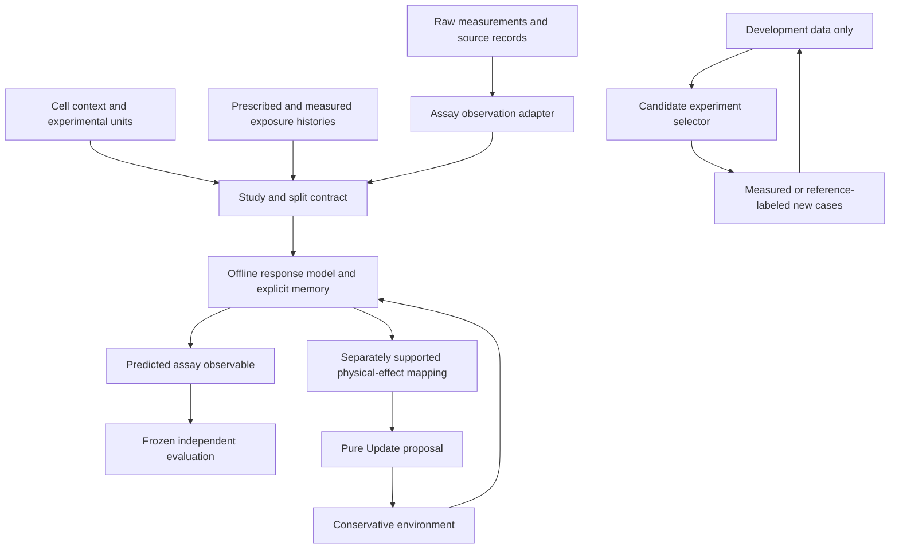

# Implementing history-aware cellular research

Evaluation date: 25 September 2026, America/Los_Angeles.

**Decision:** develop a small, assay-aware cell-response research layer with
explicit exposure histories and persistent response state. The user's clarified
learning target is the **virtual cell model itself**, potentially trained through
RL environments; an agentic experiment controller is optional. The companion
[cell-model RL design](CELL_MODEL_RL_ENVIRONMENTS.md) defines that training boundary,
MiMo reuse assessment and the path to interacting cell populations. Start with a
synthetic numeric-cell episode and an independent measured-data ingestion track,
then evaluate shared/context-specific models and experiment selection. General cell R&D reuses
the study contracts; each biological context retains its own observations,
model assumptions, parameters and applicability evidence.

This is an implementation proposal and source/data feasibility evaluation.
Continuous memory, biological data ingestion, shared-model adaptation and active
experiment selection are not implemented by this change. The current executable
scope remains the synthetic reference described in [PROTOTYPE_REPORT.md](PROTOTYPE_REPORT.md).
The accompanying [study template](../configs/history_response_study.template.json)
is nonrunnable and has no runtime parser. Unknown biological values remain null.

## 1. Research value and implementation decisions

| Direction | Decision | Proposed contribution | Required evidence before expansion |
|---|---|---|---|
| Compact exposure memory | First research priority | Identify the smallest retained state that improves prediction under a new exposure schedule | Improvement beyond current-state and exposure-summary controls on independent experimental units; sensitivity and identifiability analysis |
| RL-trained cell-response dynamics | Primary environment-design track | Learn persistent response and admissible physical effects from trajectory/assay feedback | Same-model supervised/sequence-fitting controls, long-horizon evaluation, independent measurements and complete training costs |
| Shared response model with context adaptation | Prepare contracts now; compare after one measured baseline | Reduce measurements needed for an unseen cell context | Shared-only, separate-fit and hierarchical controls; outer context holdout and inner support/query episodes |
| Adaptive experiment selection | Design a finite candidate-pool comparison after measured baselines | Distinguish response hypotheses or reach a fixed error with fewer measurements | Random, coverage and information-based controls under equal allowed information and complete costs |
| Self-play pretraining | Defer a learned generator until simpler selection has headroom | Improve a bounded synthetic curriculum or experiment-proposal policy | Independent labels, matched budgets, fixed final cohorts and an advantage over cheaper selection |
| Contrastive RLCD | Optional experiment-proposal/ranking research | Improve proposals under an explicit, independently scored rubric | Compare prompting, positive-only distillation and independently labeled preferences; no self-generated biological truth |
| Molecular-to-physical response mapping | Add only for a supported measured function | Execute an identified response law inside a physical environment | Paired functional evidence, units, conservative effects, continuation and coupling-error studies |
| General engines, large foundation training, clinical personalization | Later stages | Broaden supported equations, contexts or scale when justified | A concrete unmet capability, actual tested builds, appropriate data and independent validation |

These decisions are our assessment of implementation value, not established
novelty or performance. A useful negative result is that a simple exposure
summary predicts as well as a learned memory state.

## 2. What the literature supports

- **Shared signatures:** IRIS learns transferable signaling signatures and
  reconstructs signaling order along developmental lineages. It motivates a
  reusable representation. Its inference task does not establish a forward
  transition law for arbitrary cells or supply a molar uptake rate. [E01]
- **History matters in some contexts:** Godet et al. report persistent responses
  following hypoxia/reoxygenation in the studied cancer systems. Co-occurring
  stresses, population selection and context differences constrain mechanistic
  interpretation. A history feature improving prediction would not by itself
  prove a cell-intrinsic memory mechanism. [E02]
- **Small models deserve strong controls:** Systema shows that systematic shifts
  can inflate genetic-perturbation prediction metrics. We adopt perturbation-
  specific and cohort-level evaluation as a design lesson; this is not a direct
  result about oxygen response. [E04]
- **Adaptive experiments already have precedent:** BATCHIE evaluates information-
  based batch selection in drug screens. A new selection policy must establish
  value against such simpler, relevant approaches. [E05]
- **Infrastructure has nearby prior art:** the PRAXIS-VirtualCell preprint covers
  contracts, adapters and evidence-aware execution. Our contribution must be
  assessed through a specific reproducible prediction or experimental-design
  result. Its results do not validate this project. [E07]

The [source registry](../evidence/research_implementation_sources.json) records
URLs, inspection depth and limitations. No reviewed method was reproduced here.

## 3. Data feasibility and first study

The first implementation should ingest one small measured table with its
experimental context. Data suitability has priority over model complexity.

| Source | Actual availability inspected | Useful first task | Decision and remaining gate |
|---|---|---|---|
| Murphy oxygen-adaptation measurements [E03, E03R] | Three small XLSX files read in memory; 124, 219 and 168 nonempty observation rows before filtering | Endpoint spheroid-radius response under declared oxygen schedules | Best first ingestion candidate; specimen identity, batch structure, condition mapping and reuse terms still need resolution |
| Godet hypoxia/reoxygenation [E02, E02D] | GEO metadata for five bulk RNA-seq samples; small processed-file listing, matrices not read | Descriptive expression contrasts and an assay-ingestion example | Insufficient alone for independent memory-model training/evaluation; no replicate identifiers or age-matched day-20 control in the listed sample design |
| IRIS sequential signaling screens [E01, E01D, E01R] | GEO file and barcode-map listings; author data documentation and paths | Separate signaling-state/history inference benchmark | Strong secondary direction; counts-to-cell-to-well-to-history mapping and reproduction gaps must be resolved first |

### Murphy: practical ingestion, population endpoints

The actual files inspected were `ExpOA_WM983b.xlsx` (11,856 bytes; 124 rows),
`ExpOA_WM793b.xlsx` (17,279 bytes; 219 rows) and `ExpOA_WM164.xlsx` (64,474 bytes;
168 rows). Counts are nonempty observations before filtering, not independent
biological replicate counts. WM164 has repeated header names, requiring explicit
column mapping. Headers include condition, replicate, day, three radii and `Keep`.
[Author data directory](https://github.com/ryanmurphy42/Murphy2022SpheroidOxygenAdaptation/tree/main/1Data)

The radial assay uses harvested/fixed spheroids. It supplies destructive
population endpoints, not repeated measurements of the same spheroid. Radius is
reported in micrometers and time in days; a pimonidazole-derived radius remains
a staining observable. Repeated `Replicate` labels across days must not establish
longitudinal pairing. The paper describes separate live imaging, which would need
its own acquisition audit. [E03]

The author's loader applies `Keep==1` for multiple/damaged-spheroid exclusions;
an additional routine applies quartile outlier processing by observable/time.
Preserve original rows, author flags and derived exclusions separately. Do not
silently adopt filtering optimized after seeing our final outcomes. Article
licensing and repository licensing are separate: no standalone repository license
was found in the inspected tree. Public access is not a verified redistribution
license. [E03R]

The present same-species tracer transfer does not implement oxygen metabolism or
spheroid growth. A radius study therefore needs an explicit offline growth/response
and observation model. A fit of radii must not be described as calibration of the
current uptake kernel. Schedule transfer, cell-line transfer and individual-cell
memory are different claims; start with only one question the design supports.

### Godet: a clear limit on the earlier recommendation

GSE240211 lists day-1 normoxia/hypoxia, day-10 normoxia/hypoxia and one condition
after ten days of hypoxia followed by ten days of reoxygenation. It contains five
deposited sample records, without an independent-replicate identifier in the
inspected metadata. The listed design lacks a matched day-20 normoxic condition.
Thus duration/age and recovery cannot be fully disentangled using this series
alone. Splitting its genes or cells into train/test would not fix that experimental
limitation. The paper's other assays remain separate evidence requiring audit.
[GEO series metadata](https://www.ncbi.nlm.nih.gov/geo/query/acc.cgi?acc=GSE240211&targ=self&form=text&view=full)

### IRIS: separate inference track

The paper/current GEO mapping is **GSE289836 for hM_d4** and **GSE327767 for
hM_d7/hE_d8**. Author `DATA.md` still places all human screens in GSE289836.
Use a verified accession/sample map rather than copying that stale instruction.
The directory listings expose processed archives of approximately 275M and 780M;
these are listing sizes, not measured RAM needs. Neither archive was downloaded.
The hM_d4 barcode documentation distinguishes Step 2-only samples; their Step 3
value `-1` means not applied, not a negative stimulation control. [E01D, E01R]

Derived H5AD files and checkpoints are referenced at private lab paths, so the
repository alone does not establish exact reproducibility. Resolve feature-build
metadata inconsistencies and any ortholog mapping before ingestion. Keep cells
from a treatment well together; cross-screen inference and forward response
prediction need separate evaluations. Code has an explicit MIT license; that does
not determine every source dataset's terms. Local Windows model training was not
attempted. [E01R]

**First question:** does an explicitly declared exposure history improve
prediction of one measured oxygen-response observable beyond current conditions,
culture age and simple accumulated-exposure summaries?

The first endpoint is intentionally unset. Select it from the authenticated data
and measurement definition before fitting. A spheroid radius, segmented internal
radius, reporter intensity and transcript signature are different observables.
Retain original units and an explicit conversion record. Gas-phase oxygen
percentage cannot become dissolved mol/m^3 without a supported conversion and
delivery model; categorical exposure can remain categorical in an offline model.

Proceed with a schedule-generalization claim only if the dataset contains enough
distinct, independently replicated schedules to reserve some without using their
outcomes for model choice. Otherwise narrow the study to a reproducible
population-response benchmark, or seek additional measurements. Random cells,
image frames or resampled fitted curves do not create independent experiments.

Do not concatenate the three candidate studies into a universal training set.
They address different biological contexts, assays and experimental units.

## 4. Architecture that general cell R&D can reuse



### Proposed contracts

| Contract | Minimum contents | Required rejection or limitation |
|---|---|---|
| `StudySpec` | Question, context, observable, claim level, allowed inputs at prediction, endpoint, split plan, controls, acceptance rationale | Cannot be execution-ready while required fields or evidence are missing |
| `ObservationRecord` | Sample/specimen/culture/batch/donor IDs as available; assay and feature identity; original units; sampling times; uncertainty and missingness; raw row/source identity; processing digest | Unknown independent-unit identity prevents independent-validation claims; no inferred pairing from similar expression |
| `ExposureTrace` | Intervention identity, compartment, prescribed versus measured delivery, biological and availability times, interval boundaries, values/units, delivery uncertainty, history completeness | Gaps, overlapping ambiguous assignments, unsupported conversions and unavailable future measurements in prediction inputs fail explicitly |
| `ResponseState` | Model/context/entity identities, schema and feature order, accepted time, continuous/discrete state, initialization provenance | Missing history is not zero history; incompatible continuation is rejected |
| `ResponsePrediction` | Observable, horizon, point/distribution output, applicability diagnostics, optional next response state | Endpoint output has no automatic physical write authority; uncertainty requires a named calibration target |
| `PhysicalEffect` | Specific rate, integrated amount, force or event type; owner; units; supported mapping; numerical interval | Apply rates for exactly the stated interval, pair transfers, and reject unsupported or overdrawn effects |
| `AdaptationEpisode` | Outer context partition, support observations, query outcomes, time cutoff, allowed fitted parameters, base/adapter digests | All fitting and preprocessing use only allowed support/development data; query cannot tune adaptation |
| `AcquisitionRound` | Candidate pool, selected cases, information visible to selector, label source, costs, failures, updated development artifacts | Selector never reads final outcomes; failed attempts consume and retain their cost |
| `CandidateBundle` | Actual bytes/digests for model, preprocessing, initialization, observation map, adapter, selector, calibrator and evaluation | Arbitrary metadata hashes are insufficient; verify every referenced executable/fitted dependency |

Store identifiers for cell type, tissue, culture preparation and donor separately.
Represent categorical stimulation as such. Record quantitative exposure only when
the measurement and units support it. Preserve destructive assays as unpaired
population observations; inferred pseudotime is an analysis output, not an
observed trajectory or proof of physical elapsed time.

A known prescribed future schedule may be an allowed input for an explicitly
defined forecast. A simulated cell's local response policy receives only signals
available at its current biological time; it does not gain knowledge of future
interventions merely because the experiment controller knows the plan.

General research workflows then specialize only the assay adapter, response law,
observable and evidence:

| Research workflow | Candidate observable | Additional context needed |
|---|---|---|
| Culture adaptation and stress recovery | Measured recovery signal or growth/internal-region response | Exposure history, culture age, density, medium/batch and delivery |
| Differentiation and reprogramming | Fate distribution plus a separately measured function | Starting state, preparation route, staged interventions and lineage evidence |
| Perturbation screening | Perturbation-specific assay response | Appropriate controls, dose/time, batch and assay processing |
| Cell manufacturing research | Assay-defined potency or yield | Lot/donor, manufacturing history and independent functional measurements |
| Immune-cell research | Assay-defined activation, persistence or target response | Effector/target identity, recognition context, contacts and relevant function |

These are proposed applications of common contracts, not supported biological
modules. Generality is evaluated one added assay/context at a time.

## 5. Small memory model before a large learned state

A first engineering candidate is a scalar relaxation state:

\[
\frac{dm}{dt}=\frac{g(u,c;\theta)-m}{\tau},\qquad
\widehat y=H(m,u,c;\phi).
\]

Here `u` is the declared exposure, `c` is the recorded context, `m` is a
dimensionless model state, `tau` has units of time, and `H` returns the named
assay observable in its declared units. `g`, `H`, parameters and initial state
are hypotheses to select using development data. No biological values or
specific regulatory mechanism are assigned by this equation.

For constant `g` and positive `tau` over an interval, the exact update is
`m_next = g + (m_current - g) * exp(-dt/tau)`. It supplies a transparent synthetic
reference for interval splitting, zero-duration behavior and restart. Changing
inputs require splitting at known discontinuities or an explicitly controlled
integration approximation. A piecewise constant example is not an exact solver
for continuously varying exposure.

Fit no more state than observations can identify. Inspect profile sensitivity
or another justified identifiability analysis; a fit can confound initial memory,
recovery time, response amplitude and measurement scale. Record whether `m` is a
population descriptor or individual-cell state. Population-average data alone
cannot identify every cell's internal dynamics. Initialize from declared
prehistory or a fitted development-only distribution; never reset memory to zero
at each observation or use future outcomes to infer the prediction's initial state.

The existing binary switch retains a state only between its thresholds. It does
not implement persistent recovery after exceeding the upper threshold. Continuous
memory therefore needs a new state contract rather than a relabeling of that switch.
The synthetic challenge must include matched current inputs with different
relevant histories; the existing memoryless uptake fixture cannot demonstrate
the benefit of a memory model.

### Proposed execution boundary

Begin with an offline, deterministic `advance_response` operation that takes
explicit state and inputs and returns a replacement state plus observations.
It must not mutate a hidden Python object. For later integration, extend the
reference transaction to own response states explicitly. Do not encode a
dimensionless memory variable as a molecular amount or append every scalar update
to the event log. Events describe discrete changes; accepted state carries the
current continuous values.

Jointly accept or reject response-state replacements and physical `Update`
effects. A checkpoint must preserve response state, initialization, model/context
identity and any RNG/integrator/event state. Same inputs after restore must replay
the declared behavior. Division is initially unsupported for this response state;
a later inheritance/reset/partition rule needs its own biological and numerical
meaning. A dimensionless state is not divided like a material amount.

Define stage clocks before coupling: the current Lie-split stepper advances each
process over a window, exposing substep time in its snapshot while the working
world retains the window-start time until publication. Later processes can see
earlier processes' advanced state. A universal `response_time == world.time`
assertion is therefore insufficient. Specify which process owns each state clock,
how boundary discontinuities split windows and when observation operators sample.

## 6. Evaluation design and failure criteria

Freeze the question, primary observable, feature availability and split rules
before fitting. Inspect public schema/protocol metadata for eligibility; record
which outcomes were already seen. Retrospective published data cannot honestly
be described as a prospectively blinded validation campaign.

### Controls and comparisons

1. Current environment, culture age and allowed snapshot features only.
2. The same inputs plus prespecified duration/dose/history summaries.
3. A small mechanistic response model with an explicit recovery state.
4. A more flexible learned state only if the simpler comparison leaves headroom.

Use comparable information, tuning budgets and preprocessing. A history model
receiving an entire trace needs a control that receives useful summaries of that
same trace. Include history shuffling within defensible experimental blocks,
state removal and synthetic parameter-recovery controls. Shuffling must preserve
the recorded design sufficiently to avoid an irrelevant task.

Hold out complete experimental units and schedules; report separately any joint
batch/schedule/context shift. When design confounds batch with schedule, the data
cannot isolate their effects. Plan replicate-level error, per-schedule and worst-
cohort results, interval coverage when fitted, and failures. Resampling must occur
at the independent-unit level, not at the individual-cell/frame level. Biological
acceptance margins derive from assay precision and the research decision and
remain null until justified. Report teacher-forced endpoints and recursive
rollouts separately; only run a rollout where the state and observations support it.
Validate connected groups of related specimens, cultures and technical replicates
where identifiers overlap. The current train/validation/test schema needs explicit
extensions for support/query episodes and any dedicated calibration partition.

### Stop or narrow the claim when

- Experimental units, schedule timing, measurement mapping or reuse terms remain
  unresolved: retain a planning or descriptive-only status as appropriate.
- History offers no useful improvement beyond the strongest summary baseline:
  retain the simpler model and report the negative result.
- Memory parameters are unidentifiable: narrow the model or collect a
  discriminating observable; do not interpret fitted variables as mechanisms.
- Apparent gains disappear under batch-aware evaluation or history controls:
  do not claim transferable memory.
- A model predicts endpoints but drifts or violates constraints in a rollout:
  retain endpoint-only applicability.
- Candidate models agree while all fail measurements: expand the hypothesis
  set; model agreement is not independent truth.

Shared-model adaptation is a later comparison. Use context/donor outer splits
and a fixed support budget within each new-context episode. Compare shared-only,
separate-fit and hierarchical controls; include shuffled context identity where
meaningful. Freeze each adapter before its query evaluation. State whether the
protocol is inductive or uses unlabeled query features; do not conceal
transductive preprocessing as new-context generalization.

## 7. Experiment selection and RLCD

Implement selection over a reviewed finite candidate pool before a learned
generator. Distinguish three label sources: synthetic equations for software and
curriculum experiments; matched independent solvers for numerical approximation;
measurements for biological prediction. Every acquisition carries its label-source
class, configuration, unit/batch identity, cost and success/failure status.

Begin with random, coverage and uncertainty/information-based selection. For model
discrimination, measure held-out predictive performance and discrimination among
specified alternatives. Disagreement alone can chase unsupported extremes or
measurement noise. Include domain checks, observation noise and diversity/batch
constraints; account for possible misspecification of every candidate model.

Compare at both a fixed label budget and a measured total cost. Count data
generation/acquisition, reference computation, fitting, tuning, failed work,
inference, evaluation and persistence. Retrospective pool replay reveals only the
selected development labels to each policy. It cannot establish how hypothetical
unmeasured interventions would perform or substitute for prospective experiments.
Once selection ends, freeze the candidate; no learner, selector, adapter or
calibrator updates occur during the final campaign.

Original contrastive RLCD generates language-model preference pairs using
contrasting prompts. It is not a biological dynamics estimator. [E06] If explored,
use a separate proposal/ranking task with a declared rubric and external checks.
Compare against direct prompting and positive-only distillation. Preferences with
independent labels are a project adaptation of RLCD, not a reproduction of its
original labeling procedure. Rule compliance may establish numerical admissibility;
it cannot label a biological hypothesis as experimentally correct.

## 8. Implementation packages and dependency order

All paths below are proposed additions/changes, not present implementations.

| Package | Change | Completion evidence |
|---|---|---|
| H01: observations and exposure | New `observations.py` and `exposure.py`; one assay adapter under tools; retain existing synthetic format | Raw-row traceability, units/conversions, explicit missingness and pairing, schedule boundary/gap handling, authenticated experimental units |
| H02: offline response state | New `response_state.py` and `response_memory.py`; independent small-model runner | Pure input/output, exact synthetic relaxation comparison, no future-input leakage, restart equivalence and invalid-state rejection |
| H03: measured history study | New assay-specific fitting/evaluation runner; extend `training.py` for verified bundles and temporal/cohort constraints | Frozen baseline comparison, observation map, identifiability, independent-unit/schedule evaluation and costs; endpoint-only where necessary |
| H04: conservative execution | Extend `state.py`, `scheduler.py`, `checkpoint.py`, then `biological_rules.py` with a supported physical mapping | Atomic memory/effect rejection, model/context binding, checkpoint migration policy, discontinuity timing, replay, balance and coupled refinement |
| H05: shared/context adaptation | New episode contract and limited adapter path; keep base model immutable | Support/query enforcement, outer context holdout, actual adapter-byte verification and stronger-control comparison |
| H06: acquisition comparison | New candidate-pool/round records and offline selector | Development-only labels, budget ledger, failures, fixed final campaign and random/coverage/information controls |

H01 and the data audit can proceed immediately. H02 can start with synthetic
engineering cases. H03 requires an accepted dataset and observable but does not
require a heavy spatial engine when the chosen model is purely offline. It does
not close B03's integrated biological gate. H04 depends on the supported response
law plus R01/R02 and N03 for physical claims. H05 and H06 are separate experiments
after the baseline; neither is a prerequisite for obtaining a first useful result.

Retain backward compatibility by versioning new state/schema and checkpoint
formats explicitly. Old checkpoints lack continuous response state; loading one
requires an explicit initialization/migration record or rejection. The current
single JSON model/preprocessing verifier can initially bind one self-contained
bundle. Do not assume hashes placed in metadata recursively verify separate files.

Regression work precedes fixes. Planned verification should include irregular
intervals, schedule discontinuities, missing prehistory, stale state, nonfinite
parameters, zero-duration calls, duplicate ownership, rejected windows, restarts,
changed model identity and holdout leakage. These are acceptance requirements;
they are not additional tests executed in this documentation change.

## 9. Local compute and standards

Small tabular ingestion, a few-parameter response model and bounded candidate-pool
comparisons are appropriate first CPU targets. Actual duration and memory must
be measured when implemented. No new machine capacity, training throughput or
GPU capability was established in this evaluation. Use processed measurements
when scientifically sufficient; raw sequencing workflows and atlas-scale training
are separate workloads with separately measured budgets.

Keep the core dependency-free while it suffices. Optional fitting/assay libraries
belong in isolated environments only after selecting a specific operation and
testing the real build. No new package versions or external solver adapters are
pinned by this proposal.

Reuse standard concepts for model equations, observations, parameters and
experiment descriptions where they fit. SBML, SED-ML and PEtab support different
parts of that workflow; they do not by themselves define our cell identity,
exposure-memory transaction or arbitrary tissue coupling. Document supported
subsets and demonstrate round trips before advertising interoperability. [E08]

## 10. Decision and evidence record

The best next deliverables are **a numeric cell-learning episode contract and one
faithful measured-data adapter**, followed by a frozen small-model comparison.
The history claim is conditional on data sufficiency; it is acceptable to conclude
that none of the inspected candidate datasets yet supports that claim.
This creates reusable cell R&D infrastructure and a falsifiable research result.
Adding large engines or a self-play trainer before that comparison has low
demonstrated value for the present question.

Repository-required baseline command, run from the project root:

```powershell
python tools/run_checks.py
```

Preserved output: `runs/checks_weh0phac/`. Windows 11, Python 3.12.6, CPU;
137 tests, 136 passed, zero failures/errors, one symlink-privilege skip. The
existing numerical/transport checks passed and the fresh-interpreter demo matched.
Their configurations and numerical results remain in that directory, unchanged.
Source/test/tool SHA-256:
`9f74a4307bc5e14d85bb0041d3753c40d044c39bd3e0b7c4c78796d8d04f8eff`.

This change adds research/design artifacts and backlog links. It does not change
runtime equations or test code. The baseline result verifies the existing
reference only. No new model was fitted, no biological campaign was run and no
external engine was executed. Source inspection is distinguished from downloaded
and authenticated training data in the source registry.

Documentation closeout commands:

```powershell
python runs/research_evaluation_closeout/assemble_manifest.py
python tools/check_manifest.py
```

The first command parses the new planning JSON, checks local document-link targets
and source references, confirms the unchanged source/test/tool identity, preserves
the prior manifest as `provenance/prototype_MANIFEST.sha256`, and assembles the
updated release manifest. It is an artifact-integrity operation, not a runtime or
scientific test. Its exact script hash, file identities and outcomes are retained
in `runs/research_evaluation_closeout/artifact_integrity.json`; manifest verification
output is in the same directory. The original ZIPs, audit and historical run
artifacts remain unchanged.
